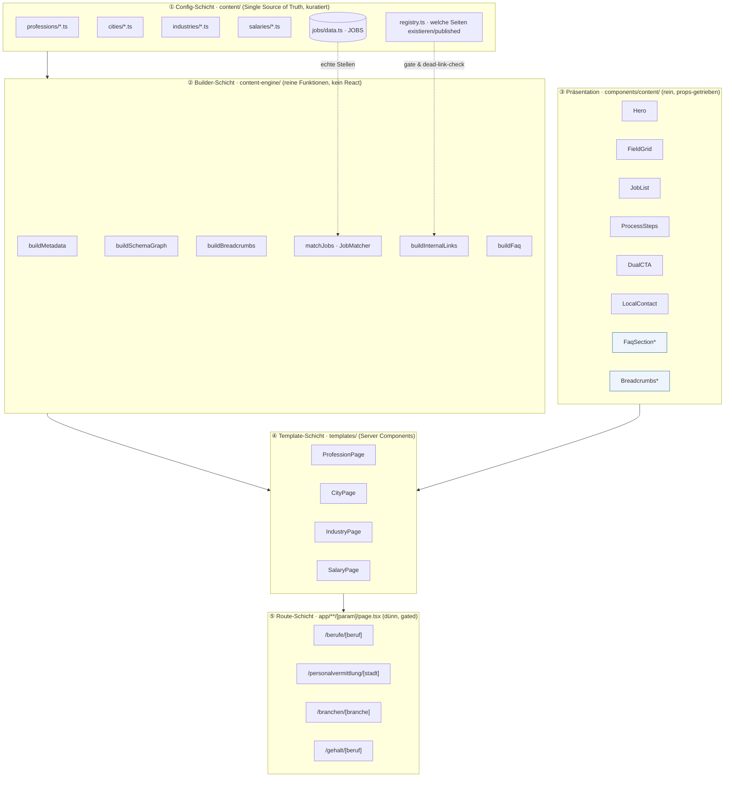
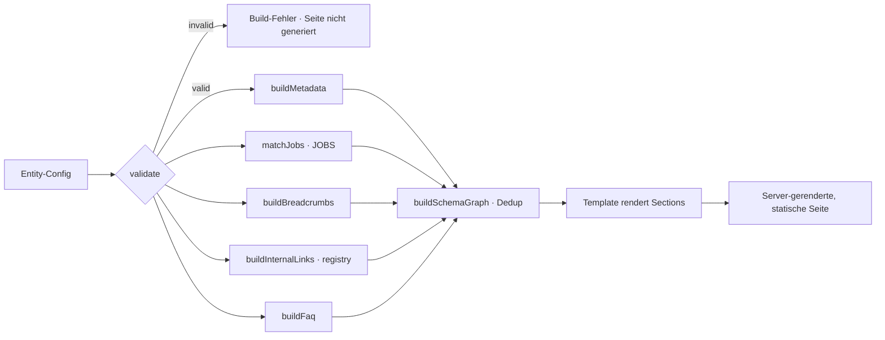
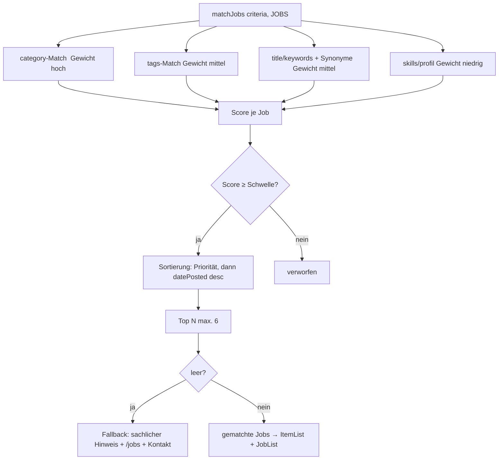
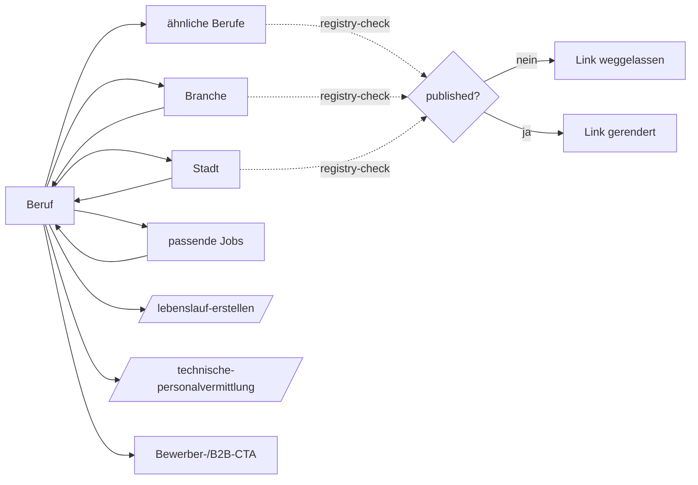
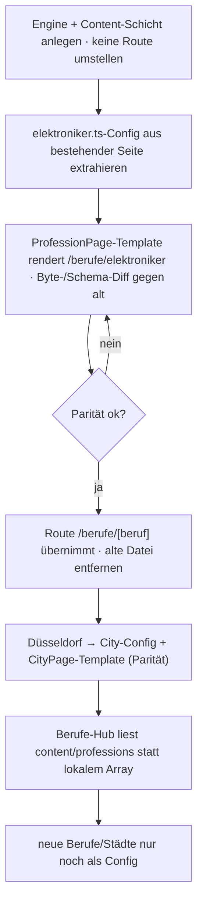

# EPIC 005 — PHE Content Engine · Architektur

**Projekt:** phe-perm.de (`phe-2026/frontend`, Next.js 16 App Router, React 19, TypeScript)
**Branch:** `architecture/content-engine`
**Charakter:** reine Architektur-/Planungsphase — **kein Produktivcode, keine Komponenten, keine Migration, kein Commit.**
**Stand:** 26.07.2026

---

## 1. Executive Summary

Die Website erzeugt SEO-Seiten heute **handgeschrieben pro Route**: `/berufe/elektroniker`, `/personalvermittlung/duesseldorf`, `/technische-personalvermittlung` sind jeweils ~250–340 Zeilen mit eigener Metadata, eigenem Schema, eigenem FAQ-Array, eigener Job-Filterung und eigener interner Verlinkung. Das ist bei einer Handvoll Seiten wartbar — aber die IA (EPIC-002) fordert **dutzende** Berufs-, Standort-, Branchen- und Gehaltsseiten. Handarbeit skaliert dort nicht und erzeugt Drift (inkonsistente Schemas, widersprüchliche Zahlen, tote Links, Duplicate/Thin Content).

Die **Content Engine** löst das durch Trennung von **Daten**, **Logik** und **Präsentation**:

- **Config-Schicht** (`content/`): typisierte Datensätze je Entität (Profession, City, Industry, Salary) — die *einzige* Quelle der Wahrheit, vom Menschen gepflegt.
- **Builder-Schicht** (`content-engine/`): reine Funktionen, die aus einer Config + der zentralen `JOBS`-Quelle **Metadata, Schema-Graph, Breadcrumbs, interne Links, gematchte Jobs und FAQ** erzeugen. Kein React.
- **Präsentations-Schicht** (`components/content/`): kleine, reine Section-Komponenten (Hero, JobList, FieldGrid, ProcessSteps, DualCTA …).
- **Template-Schicht** (`templates/`): je Entitätstyp eine Page-Vorlage (Server Component), die Builder-Output + Sections zusammensetzt.
- **Route-Schicht** (`app/.../[param]/page.tsx`): dünne dynamische Routen mit `generateStaticParams` aus der Config, **gated** über ein `published`-Flag.

**Kernprinzip:** *Struktur wird generiert, Substanz wird kuratiert.* Slugs, Canonicals, Breadcrumbs, Joblisten (aus echten Stellen), Schema-Graph, Metadata-Gerüst und der interne Link-Graph werden **automatisch** erzeugt. Gehaltszahlen, Marktaussagen, Referenzen, Garantien, NAP, GF-Positionierung und die eigentlichen FAQ-Antworten werden **niemals** automatisch erzeugt.

**Ergebnis:** eine neue Berufsseite entsteht künftig durch das Anlegen **eines Config-Objekts** (nicht einer 340-Zeilen-Datei), mit garantiert konsistentem Schema, korrekten Canonicals, deduplizierten JSON-LD-Blöcken und ausschließlich existierenden internen Links.

---

## 2. Analyse des Ist-Zustands

### 2.1 Routing / App-Router
```
app/
├── page.tsx                          Startseite (client)
├── layout.tsx                        globales Metadata-Template + Org/WebSite-Schema (@id #organization)
├── jobs/
│   ├── page.tsx                      Joblist (client, Filter nur Client-State, kein ?q)
│   ├── data.ts                       zentrale JOBS-Quelle + Helfer
│   └── [slug]/page.tsx               Job-Detail (statisch, JobPosting+Breadcrumb, permanentRedirect Canonical)
├── berufe/
│   ├── page.tsx                      Berufe-Hub (BERUFSFELDER + hasJobsFor + detailHref)
│   └── elektroniker/page.tsx         erste Berufsdetailseite (Vorlage)
├── technische-personalvermittlung/   B2B-Pillar (Service+FAQPage+Breadcrumb)
└── personalvermittlung/duesseldorf/  lokale B2B-Seite (LocalBusiness @id #organization + Service + FAQPage)
```

### 2.2 Datenmodell (`jobs/data.ts`) — bestätigt
```ts
type Job = {
  id: string; title: string;
  category: "elektro" | "mechatronik" | "it" | "bau";
  city: string; region: string; lat: number; lng: number;
  salary: string;            // Freitext, z. B. "45.000 – 50.000 €/Jahr"
  type: string;              // z. B. "Festanstellung"
  tags: string[];
  description: string; posted: string; benefits: string[];
  datePosted: string;        // ISO — Quelle für JobPosting-Schema
  intro?: string; aufgaben?: string[]; profil?: string[];
};
// Helfer: validThroughOf(job), parseSalaryRange(salary) → {min,max}|null
```

### 2.3 Zentrale Bausteine — bestätigt
| Baustein | Ort | Signatur / Verhalten |
|---|---|---|
| Slug-Logik | `lib/slug.ts` | `slugify`, `jobSlug`, `jobPath` (→ `/jobs/<slug>-<id>`), `jobIdFromParam` |
| Breadcrumbs | `components/Breadcrumbs.tsx` | `({ items: {name,href}[] })` → **sichtbare Leiste + BreadcrumbList-JSON-LD** (via `JsonLd`) |
| FAQ | `components/FaqSection.tsx` | `({ items:{q,a}[], title })` → sichtbare `<details>/<summary>`, **ohne** Schema |
| JSON-LD | `components/JsonLd.tsx` | `({ data:object })` → genau **ein** `<script type="application/ld+json">` |
| Globales Schema | `layout.tsx` | `WebSite` + `Organization/LocalBusiness/EmploymentAgency` (`@id #organization`), auf **jeder** Seite |
| Metadata | `layout.tsx` | Template `"%s | PHE-Perm Engineering"`, `metadataBase`; Seiten setzen `title`/`title.absolute` + `alternates.canonical` |
| Design | `globals.css` + Inline-Styles | Tokens (`--navy`, `--blue` …), `.pathswitch-cta`-Klassen mit `:focus-visible` |

### 2.4 Etablierte Muster (die die Engine bewahren muss)
- **FAQ + FAQPage-Schema aus *einem* Array** (Google-Deckungspflicht).
- **CollectionPage + ItemList** verweist auf **kanonische** Job-URLs; **kein** JobPosting-Schema auf Nicht-Detailseiten dupliziert.
- **`@id #organization` wiederverwenden** für lokale LocalBusiness-Knoten → eine Entität, keine Duplikate.
- **Inventar-/Substanz-Gate** (`hasJobsFor`) statt leerer Kategorien.
- **Sprechende Slugs + `permanentRedirect`** auf kanonische URL.
- **Genau eine H1, ein Canonical, ein BreadcrumbList je Seite.**

### 2.5 Schmerzpunkte (die die Engine beseitigt)
1. **Duplizierte Boilerplate** pro Seite (Metadata + Schema + Breadcrumb-Items + FAQ-Array + Job-Filter + Link-Blöcke).
2. **Ad-hoc Job-Matching** (`category==="elektro"` hier, Keyword-Match dort) — kein zentrales System.
3. **Manuelle interne Links** → Drift-/Dead-Link-Risiko; kein Registry-Check.
4. **Schema-Zusammenbau von Hand** → Doppelungs- und `@id`-Konfliktrisiko (bereits einmal aufgetreten: doppelter LocalBusiness).
5. **Kein Gate-Mechanismus** außer manuellem `hasJobsFor` → Thin-Content-Gefahr bei Skalierung.

---

## 3. Architekturdiagramm


`*` = bereits vorhandene Komponenten (`Breadcrumbs`, `FaqSection`) — werden wiederverwendet, nicht ersetzt.

---

## 4. Empfohlene Ordnerstruktur

```
frontend/src/
├── content/                         # ① SINGLE SOURCE OF TRUTH (kuratiert)
│   ├── registry.ts                  # published-Flags + Slug→Typ-Auflösung (Dead-Link-Guard)
│   ├── professions/
│   │   ├── _type.ts                 # Profession-Typ + Zod-ähnliche Runtime-Validierung
│   │   ├── elektroniker.ts
│   │   └── …                        # je Beruf 1 Datei
│   ├── cities/
│   │   ├── _type.ts
│   │   └── duesseldorf.ts
│   ├── industries/
│   │   └── _type.ts
│   ├── salaries/
│   │   └── _type.ts
│   └── shared/
│       ├── nap.ts                   # eine kanonische NAP-Quelle (Name/Adresse/Festnetz/WhatsApp/Geo/Hours)
│       ├── faq-library.ts           # wiederverwendbare, kuratierte FAQ-Bausteine
│       └── cta-library.ts           # kuratierte CTA-Bausteine
│
├── content-engine/                  # ② BUILDER (reine Funktionen, unit-testbar)
│   ├── metadata.ts                  # buildMetadata(entity)
│   ├── schema/
│   │   ├── graph.ts                 # buildSchemaGraph(entity, ctx) + Dedup-Registry
│   │   ├── nodes.ts                 # collectionPage(), service(), localBusiness(), faqPage(), itemList()
│   │   └── ids.ts                   # zentrale @id-Konstanten (#organization …)
│   ├── breadcrumbs.ts               # buildBreadcrumbs(entity)
│   ├── matcher.ts                   # matchJobs(criteria, JOBS) · JobMatcher
│   ├── links.ts                     # buildInternalLinks(entity, registry)
│   └── faq.ts                       # buildFaq(entity) (nur Komposition kuratierter Antworten)
│
├── components/content/              # ③ PRÄSENTATION (rein, keine Logik)
│   ├── Hero.tsx  · FieldGrid.tsx  · JobList.tsx  · ProcessSteps.tsx
│   ├── DualCTA.tsx  · LocalContact.tsx  · RelatedLinks.tsx  · Section.tsx
│   └── (bestehend, wiederverwendet: ../Breadcrumbs.tsx, ../FaqSection.tsx, ../JsonLd.tsx)
│
├── templates/                       # ④ TEMPLATES (Server Components)
│   ├── ProfessionPage.tsx  · CityPage.tsx  · IndustryPage.tsx  · SalaryPage.tsx
│
└── app/                             # ⑤ ROUTES (dünn)
    ├── berufe/[beruf]/page.tsx       # generateStaticParams aus content/professions
    ├── personalvermittlung/[stadt]/page.tsx
    ├── branchen/[branche]/page.tsx
    └── gehalt/[beruf]/page.tsx
```

**Prinzipien:** Daten liegen zusammen (`content/`), nicht nach technischer Schicht verstreut. Jede Engine-Funktion hat *eine* Verantwortung und ist ohne React testbar. Präsentation kennt keine Config, nur Props.

---

## 5. Content-Modelle

Legende: **P** = Pflicht · **O** = optional · **A** = auto (Builder erzeugt, nicht in Config) · **N** = niemals automatisch (kuratiert).

### 5.1 Profession
| Feld | Art | Beschreibung |
|---|---|---|
| `slug` | P | z. B. `elektroniker` (URL-Segment, ASCII) |
| `name` | P | Anzeigename |
| `title` / `metaDescription` | P/O | Metadata (O: sonst aus Vorlage generiert) |
| `h1`, `heroIntro` | P | Hero-Texte (kuratiert **N**) |
| `berufsbild`, `fachrichtungen[]`, `einsatzbereiche[]`, `anforderungen[]` | P/O | Fachinhalt, **N** |
| `matcher` | P | JobMatcher-Kriterien (siehe §7) |
| `relatedProfessions[]` | O | Slugs verwandter Berufe (für interne Links) |
| `industries[]`, `defaultCity?` | O | Verknüpfung zu Branchen/Stadt |
| `faq[]` | P | kuratierte Q&A (**N**) — Quelle für sichtbares FAQ **und** Schema |
| `published` | P | Gate-Flag |
| **Wiederverwendbarkeit** | | hoch — Template `ProfessionPage` rendert jede Profession |

### 5.2 City
| Feld | Art | Beschreibung |
|---|---|---|
| `slug`, `name` | P | z. B. `duesseldorf`, „Düsseldorf" |
| `title`/`metaDescription`, `h1`, `heroIntro` | P | kuratiert **N** |
| `localContext` | O | echter regionaler Bezug (**N**, nur belegbar) |
| `nap` | A/P | referenziert `content/shared/nap.ts` (keine NAP-Erfindung) |
| `hasLocalPresence` | P | true nur bei echtem Standort/Einzugsgebiet (Gate gegen Doorways) |
| `serviceAreas[]`, `industries[]` | O | für Verlinkung/areaServed |
| `faq[]` | P | kuratiert |
| `published` | P | Gate |
| **Wiederverwendbarkeit** | | hoch — aber **striktes Substanz-Gate** (§10) |

### 5.3 Industry
| Feld | Art | Beschreibung |
|---|---|---|
| `slug`, `name` | P | z. B. `maschinenbau` |
| `title`, `h1`, `intro`, `beschreibung` | P | **N** |
| `relatedProfessions[]` | P | Berufe der Branche (Verlinkung) |
| `matcher?` | O | optionale Job-Zuordnung |
| `published`, `hasSubstance` | P | Gate: nur Branchen mit echtem Bezug |
| **Wiederverwendbarkeit** | | hoch |

### 5.4 Salary (Gehalt)
| Feld | Art | Beschreibung |
|---|---|---|
| `professionSlug` | P | Bezug zum Beruf |
| `title`, `h1`, `intro` | P | **N** |
| `salarySource` | P | **belegte** Quelle: entweder aus echten `JOBS`-Spannen (`parseSalaryRange`) **oder** kuratierte, referenzierte Angabe. **Nie geschätzt.** |
| `factors[]` | O | Einflussfaktoren (fachlich, **N**) |
| `published` | P | Gate — erst live, wenn belegte Zahlen vorliegen |
| **Wiederverwendbarkeit** | | mittel — höchstes Erfindungsrisiko, strengste Regeln |

### 5.5 FAQ (Modell)
| Feld | Art |
|---|---|
| `q` (Frage) | P, **N** |
| `a` (Antwort) | P, **N** (keine Preise/Garantien/Zahlen erfinden) |
| Wiederverwendbarkeit | sehr hoch — sichtbares FAQ **und** FAQPage-Schema aus demselben Array (Muster bewahren) |

### 5.6 CTA (Modell)
| Feld | Art |
|---|---|
| `label` | P |
| `href` | P (muss über `registry` existieren — Dead-Link-Guard) |
| `variant` | O (`primary`/`secondary` → `.pathswitch-cta`) |
| `target` | A (extern → `_blank rel=noopener`) |
| Wiederverwendbarkeit | sehr hoch (`cta-library.ts`) |

### 5.7 Hero (Modell)
| Feld | Art |
|---|---|
| `eyebrow`, `h1`, `intro` | P, **N** |
| `primaryCta`, `secondaryCta` | P/O (CTA-Modell) |
| Wiederverwendbarkeit | hoch — eine `Hero`-Komponente je Template |

### 5.8 Metadata (Builder-Output)
| Feld | Art |
|---|---|
| `title` (oder `title.absolute`) | A (aus `name`/Vorlage; `absolute` bei Bedarf) |
| `description` | A/O (Config-Override möglich) |
| `alternates.canonical` | **A** (immer aus Slug generiert — nie manuell) |
| `openGraph.{title,description,url,type}` | A |
| Wiederverwendbarkeit | vollständig generisch |

### 5.9 Schema (Builder-Output)
| Feld | Art |
|---|---|
| `@type` je Entität | A (CollectionPage/WebPage, ItemList, FAQPage, BreadcrumbList, LocalBusiness/Service) |
| `@id`-Referenzen | A (`#organization` aus `ids.ts`) |
| Dedup | A (Graph-Registry verhindert doppelte @types/@ids) |
| Wiederverwendbarkeit | vollständig generisch |

### 5.10 JobMatcher (Config-Teilmodell) — siehe §7
### 5.11 InternalLinks (Builder-Output) — siehe §8
### 5.12 Trust
| Feld | Art |
|---|---|
| `reviewRating`, `reviewCount` | **N** — nur echte, belegte GBP-Werte; sonst weglassen (kein AggregateRating erfinden) |
| `usps[]` | **N** (GF-Positionierung) |
| Wiederverwendbarkeit | hoch, aber inhaltlich strikt kuratiert |

### 5.13 Contact
| Feld | Art |
|---|---|
| `name`, `street`, `zip`, `city` | P — **eine** Quelle `content/shared/nap.ts` |
| `phone` (Festnetz) | P — **nie** WhatsApp als primäre Telefonnummer |
| `whatsapp` | O — nur als `contactPoint`/WA-Link |
| `openingHours` | O — nur wenn **sichtbar** ausgegeben (Schema↔sichtbar konsistent) |
| `geo` | O — **nur verifiziert** (GBP), sonst weglassen |
| Wiederverwendbarkeit | maximal — global genutzt |

---

## 6. Builder-Konzept



**Ablauf pro Route-Aufruf (Server Component):**
1. **Resolve:** Slug → Config aus `content/`. Nicht gefunden oder `published:false` → `notFound()`.
2. **Validate:** Runtime-Check der Pflichtfelder (Build/Dev bricht bei Lücken ab → keine Thin-Seite).
3. **Builder (rein, parallel):** `metadata`, `matchedJobs`, `breadcrumbs`, `internalLinks`, `faq`.
4. **Schema-Graph:** komponiert die passenden Knoten, dedupliziert per Registry, referenziert `#organization`.
5. **Render:** Template setzt Präsentations-Sections + `JsonLd`-Blöcke + `Breadcrumbs` + `FaqSection` zusammen.

`generateMetadata` der Route ruft nur `buildMetadata(config)` auf. `generateStaticParams` liest die `published`-Slugs aus `content/`. **Alles Server-seitig, statisch vorgerendert.**

---

## 7. Job-Matching-Konzept (zentral)

Ein **einziger** Matcher ersetzt die verstreute Ad-hoc-Logik. Config je Entität deklariert *Kriterien*; der Matcher wertet gewichtet gegen die echte `JOBS`-Quelle aus.



**Kriterien-Modell (in der Config):**
```
matcher: {
  category?: JobCategory[]        // strukturiert, höchstes Gewicht (z. B. ["elektro"])
  tags?: string[]                // gegen job.tags
  keywords?: string[]            // gegen job.title/description
  synonyms?: Record<string,string[]>  // z. B. "sps" → ["steuerungstechnik","tia portal"]
  minScore?: number              // Schwelle
  priorityBoost?: string[]       // bestimmte Titel/Slugs nach oben
  limit?: number                 // default 6
}
```
- **Gewichtung:** `category` > `tags` ≈ `keywords` > `skills`. Verhindert unsaubere Volltext-Treffer, wenn strukturierte Signale existieren.
- **Synonyme:** zentrale Liste (`content/shared/synonyms.ts`) — Elektroniker↔Betriebselektriker, SPS↔Steuerungstechnik usw.
- **Fallback:** kein erfundener Job; sachlicher Hinweis + Link zu `/jobs` + Kontakt (Muster der Elektroniker-Seite).
- **Determinismus:** stabile Sortierung (Priorität → `datePosted` desc → id) für reproduzierbare Builds.

---

## 8. Interne Verlinkungslogik (automatisch, Dead-Link-frei)



**Regeln:**
- `buildInternalLinks` prüft **jeden** Ziel-Slug gegen `content/registry.ts`. Nicht publiziert → **Link entfällt** (keine toten Links, keine Links auf noch nicht existierende Detailseiten).
- **Variierte Anchor-Texte** aus einer kleinen Vorlagenmenge (kein identischer Exact-Match auf jeder Seite).
- **Reziprozität:** Beruf↔Stadt↔Branche↔Jobs bilden einen Graphen; jede strategische Seite ist ≤ 3 Klicks von der Startseite (EPIC-002-Ziel).
- **Job→Beruf-Backlink:** Job-Detailseiten verlinken auf die passende Berufsseite **nur**, wenn diese `published` ist (heute manuell für elektro; künftig registry-getrieben).

---

## 9. Schema-Strategie

| Seitentyp | Automatisch erzeugte Knoten | Optional |
|---|---|---|
| Profession | `CollectionPage` + `ItemList`(kanonische Job-URLs) + `BreadcrumbList` + `FAQPage` | — |
| City | `LocalBusiness`(@id #organization) + `Service`(areaServed) + `BreadcrumbList` + `FAQPage` | `geo` nur verifiziert |
| Industry | `CollectionPage`/`WebPage` + `BreadcrumbList` + `FAQPage` | `ItemList` bei Job-Bezug |
| Salary | `WebPage` + `BreadcrumbList` + `FAQPage` | — |
| global (alle) | `WebSite` + `Organization/LocalBusiness/EmploymentAgency` (`layout.tsx`) | — |

**Doppelungs-Vermeidung (harte Regeln im `buildSchemaGraph`):**
1. **Eine `@id`-Konstante** (`#organization`) — lokale Knoten *referenzieren* sie, statt eine zweite Entität zu schaffen.
2. **Dedup-Registry:** der Graph merkt sich bereits emittierte `@type`/`@id`; ein Typ wird pro Seite nur einmal ausgegeben.
3. **BreadcrumbList kommt ausschließlich aus der `Breadcrumbs`-Komponente** — der Schema-Builder erzeugt keinen zweiten.
4. **Kein `JobPosting`** auf Nicht-Detailseiten (nur `ItemList`-Verweise auf kanonische Job-URLs).
5. **Kein `AggregateRating`**, solange keine echten, belegten GBP-Werte vorliegen.
6. **Konflikt-Guard:** teilt ein lokaler Knoten `@id #organization`, dürfen nur **nicht-widersprüchliche** Felder gesetzt werden (Name/Adresse/Telefon identisch; abweichende `url`/`image`/`geo` verboten).

---

## 10. Regeln gegen Duplicate & Thin Content

- **Substanz-Gate:** Eine Seite ist nur `published:true`, wenn Pflicht-Fachinhalt + (wo relevant) Job-Inventar vorhanden ist. Der Builder **bricht** bei fehlenden Pflichtfeldern ab.
- **Kein Template-Klon:** Jede Profession/City braucht einzigartigen kuratierten Fachtext (Berufsbild/lokaler Bezug). Nur ausgetauschte Begriffe sind verboten.
- **Inventar-abhängige Joblisten:** aus echten `JOBS`; keine erfundene Stellenzahl; 0-Treffer → sachlicher Fallback statt Fake.
- **Kanonische URLs** immer generiert; Facetten/Filter bleiben `noindex`.
- **Beruf×Stadt-Kombinationen** nur indexierbar bei ausreichendem echten Inventar (EPIC-002-Gate) — die Engine erzwingt das über den Matcher-Score/Count.
- **Ein Canonical, eine H1** je Seite — durch Template garantiert.
- **Variierte Anchor-Texte** (§8) gegen Anchor-Duplizierung.

---

## 11. Migration der bestehenden Seiten

**Grundsatz:** additiv, verlustfrei, hinter Feature-Parität. Keine URL ändert sich.



| Seite | Migrationsschritt | Risiko |
|---|---|---|
| `/berufe/elektroniker` | → `professions/elektroniker.ts` + `ProfessionPage`; Schema/Metadata-Parität verifizieren | niedrig (Vorlage passt exakt) |
| `/personalvermittlung/duesseldorf` | → `cities/duesseldorf.ts` + `CityPage`; `@id`-/NAP-/geo-Regeln in den Builder ziehen | mittel (LocalBusiness-Feinheiten) |
| `/berufe` (Hub) | `BERUFSFELDER` → aus `content/professions` ableiten; `detailHref` aus `registry` | niedrig |
| `/technische-personalvermittlung` (Pillar) | **vorerst belassen** (Sonderfall mit Formular/Client) — später optional als eigenes Template | niedrig |
| `jobs/data.ts` | unverändert Quelle des Matchers | keins |

**Parität-Nachweis je Migration:** Status 200, genau 1 H1, identischer Canonical, gleiche Schema-`@type`s (je 1), FAQ sichtbar=Schema, gleiche/kanonische interne Links, `npm run test` + `build` grün, Lint = Baseline.

---

## 12. Risiken & Nachteile

| Risiko | Wirkung | Gegenmaßnahme |
|---|---|---|
| **Über-Abstraktion** (Engine komplexer als Nutzen bei wenigen Seiten) | Wartungslast | schlank starten (nur Profession+City), erst bei ≥ ~10 Seiten ausbauen |
| **Config-Validierung fehlt** → Thin/kaputte Seiten | SEO-Schaden | Runtime-Validierung + Build-Abbruch bei Pflichtlücken |
| **Programmatic-Sprawl** (Massenseiten dünn) | Google-Abwertung/Doorways | Substanz-/Inventar-Gate (§10), `published`-Flag |
| **Schema-Regression** in generischem Builder | Rich-Result-Verlust | Snapshot-Tests der JSON-LD-Graphen je Template |
| **Erfundene Daten** durch Automatisierung | Vertrauens-/Rechtsrisiko | „niemals auto"-Liste (§ N-Felder) hart im Datenmodell; Gehalt nur belegt |
| **NAP/geo-Inkonsistenz** | Local-SEO-Schaden | eine `nap.ts`-Quelle; geo nur verifiziert |
| **Migrations-Drift** (Parität nicht exakt) | Ranking-Dip | Byte-/Schema-Diff-Gate vor Umstellung; keine URL-Änderung |
| **Client/Server-Grenze** | CWV | Templates als Server Components; Interaktion nur als kleine Inseln |

---

## 13. Empfohlene Implementierungsreihenfolge

```mermaid
flowchart LR
    S1[1 · Typen + content/-Schicht + registry + nap.ts] --> S2
    S2[2 · content-engine: matcher, metadata, breadcrumbs, links] --> S3
    S3[3 · schema/graph + nodes + Dedup + Snapshot-Tests] --> S4
    S4[4 · Präsentations-Sections + ProfessionPage-Template] --> S5
    S5[5 · elektroniker migrieren · Parität verifizieren] --> S6
    S6[6 · Route /berufe/[beruf] + Hub aus Config] --> S7
    S7[7 · CityPage + Düsseldorf migrieren] --> S8
    S8[8 · neue Berufe/Städte als Config · Industry/Salary später] --> S9
    S9[9 · Beruf×Stadt-Longtail (gated)]
```

Jede Stufe ist eigenständig testbar und liefert Wert; **erst nach bewiesener Parität** (Stufe 5/7) werden Routen umgestellt.

---

## 14. Definition of Done (Architekturphase)

- [x] Ist-Zustand analysiert und dokumentiert (Routing, Datenmodell, Komponenten, Muster).
- [x] Architekturdiagramm (Schichten) vorhanden.
- [x] Ordnerstruktur empfohlen.
- [x] Content-Modelle (Profession, City, Industry, Salary, FAQ, CTA, Hero, Metadata, Schema, JobMatcher, InternalLinks, Trust, Contact) mit Pflicht-/Optional-Feldern definiert.
- [x] Builder-Konzept (Config→Render-Pipeline) beschrieben.
- [x] Zentrales Job-Matching-Konzept (Kriterien, Gewichtung, Synonyme, Fallback) beschrieben.
- [x] Automatische interne Verlinkung inkl. Dead-Link-Guard beschrieben.
- [x] Schema-Strategie inkl. Doppelungs-Vermeidung definiert.
- [x] Regeln gegen Duplicate/Thin Content festgelegt.
- [x] Migrationsplan mit Parität-Nachweis erstellt.
- [x] Risiken/Nachteile benannt und mit Gegenmaßnahmen versehen.
- [x] Implementierungsreihenfolge festgelegt.
- [x] Offene GF-Entscheidungen gelistet (§15).
- [x] **Kein Produktivcode, kein Commit.**

**DoD der späteren Implementierung (je Seitentyp):** Status 200 · 1 H1 · korrekter Canonical · Schema je Typ 1× ohne Doppelung · FAQ sichtbar=Schema · nur existierende interne Links · Matcher aus echten Jobs · Substanz-/Inventar-Gate erfüllt · Tests+Build grün · Lint 0 neu · keine erfundenen Zahlen/Referenzen/Garantien.

---

## 15. Offene Entscheidungen des Geschäftsführers

1. **Umfang/Zeitpunkt:** Content Engine jetzt bauen (ab ~10 geplanten Seiten lohnend) oder Berufs-/Stadtseiten vorerst weiter einzeln?
2. **Gehaltsseiten:** Zahlen aus echten `JOBS`-Spannen ableiten, kuratierte belegte Werte pflegen — oder Gehaltsseiten vorerst zurückstellen? (höchstes Erfindungsrisiko)
3. **Reale Städte/Branchen:** Welche `/personalvermittlung/[stadt]` und `/branchen/[branche]` werden **tatsächlich** bedient (Substanz-Gate)? Ohne echten Bezug keine Seite.
4. **Trust-Daten:** Dürfen echte GBP-Bewertungen (Rating/Count) für `AggregateRating` verwendet werden? (nur belegt)
5. **NAP/Geo:** Bestätigung der kanonischen Quelle in `content/shared/nap.ts` (Festnetz primär, verifizierte GBP-Geo).
6. **„IT/Engineering/Software":** aktiv als Fachbereiche besetzen (eigene Configs) oder vorerst nur im Bestand belassen?
7. **Redaktion:** Wer pflegt die kuratierten Fachtexte/FAQ je Beruf/Stadt (Voraussetzung gegen Thin Content)?
8. **YAFTO:** bleibt außerhalb der Engine/SEO-Architektur (bestätigt).

---

*Reine Architektur-Dokumentation. Kein Produktivcode geschrieben, keine Komponente/Seite erstellt oder geändert, kein Commit erzeugt.*
